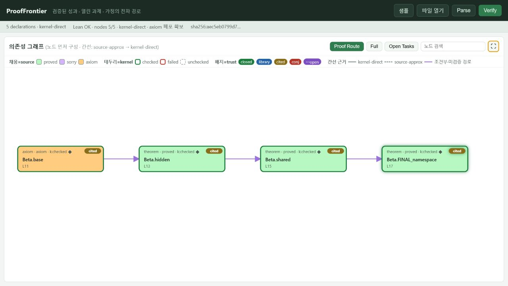

# ProofFrontier

> 증명된 것, 가정된 것, 아직 열린 것, 편집으로 무효화된 것을 함께 보여줍니다.

ProofFrontier는 진행 중인 Lean 형식화를 위한 로컬 연구 작업대입니다. 선언을
의존성 그래프로 만들고, 검증된 성과와 열린 과제, 외부 가정, 오래된 검증
근거를 서로 섞지 않고 보여줍니다.

긴 수학 증명과 난제 연구에서는 단순한 통과·실패만으로 충분하지 않습니다.

- 이 소스에서 Lean이 실제로 확인한 선언은 무엇인가?
- 어느 결과가 아직 `sorry`이거나 선언된 axiom에 기대는가?
- 외부 문헌과 신규 가설은 어떤 경로로 최종 정리에 도달하는가?
- 어떤 간선이 커널 근거이고 어떤 간선이 소스 근사인가?
- 소스를 수정한 뒤 어떤 검증 결과가 더 이상 유효하지 않은가?

ProofFrontier는 미완성 작업을 증명으로 바꾸지 않습니다. 미완성 상태를 위치와
근거가 있는 연구 상태로 보존하여, 성과와 한계를 과장하지 않고 검토·분담·완료할
수 있게 합니다.

> 실험 버전: `0.1.0`. ProofFrontier는 감사와 연구 진행을 돕는 도구이며, 형식
> 명제의 의미 일치, import된 라이브러리, 신뢰 컴퓨팅 기반에 대한 검토를
> 대신하지 않습니다.

[English README](README.md) ·
[방법론](docs/METHODOLOGY.ko.md) ·
[검증 기록](docs/VALIDATION.md) ·
[관련 작업](docs/RELATED_WORK.md) ·
[로드맵](docs/ROADMAP.md)



## 핵심 목적

일반적인 Lean 빌드는 제출한 소스가 정교화되는지를 답합니다. ProofFrontier는
증명이 완성되기 전의 연구 상태도 살펴볼 수 있도록 설계되었습니다.

열린 보조정리, 문헌에서 가져온 정리, 프로젝트가 새로 도입한 추측은 서로 다른
연구 상태입니다. ProofFrontier는 이를 이름 있는 노드로 유지하고, 하위 결론에
미치는 영향을 전파하며, 각 시각 정보가 정적 분석과 Lean Environment 중 어느
근거에서 왔는지 기록합니다.

따라서 다음 작업에 사용할 수 있습니다.

- 현재 증명 경계와 병목 보조정리 확인
- 조건부 결론과 신규 가설의 영향 범위 파악
- 인계하거나 검토할 수 있는 선언 단위 과제 식별
- 증명된 성과와 남은 한계를 함께 보고
- 편집으로 무효화된 검증 결과의 즉시 제거

`0.1.x`는 단일 파일용 증거 작업대입니다. 프로젝트 전체 이력, 담당자, 리뷰
큐, 토론 메타데이터는 현재 기능이 아니라 로드맵에 포함된 협업 기능입니다.

## 독립된 세 축

| 축 | 값 | 질문 | 시각 표현 |
|---|---|---|---|
| `kernel` | `checked` / `failed` / `unchecked` | 이 소스의 이 선언이 인증된 Environment에 존재하는가? | 노드 테두리 |
| `source` | `proved` / `sorry` / `axiom` | 소스가 어떤 완결 상태를 주장하는가? | 노드 채움 |
| `trust/provenance` | `closed` / `library` / `cited-external` / `conjectural` | 결론이 전이적으로 무엇에 기대는가? | 배지 |

예를 들어 `checked + proved + conjectural`은 Lean이 받아들인 올바른 선언이지만,
프로젝트의 미증명 가설에 조건부로 의존합니다. `checked`만으로 닫힌 증명이라고
말하지 않습니다.

`verified-closed`는 다음 조건을 모두 만족할 때만 성립합니다.

```text
kernel=checked
source=proved
trust=closed
전이적 sorryAx 의존 없음
```

Trust 배지는 가정의 provenance를 탐색하기 위한 보수적 요약입니다. 자유 형식
인용문 자체가 기계적으로 검증됐다는 뜻은 아니며, 실제 axiom 폐포를 상세 화면에
함께 표시합니다.

## 증거 승격 과정

```text
Lean 소스
  -> 정적 선언 파싱
  -> 완전수식 노드 + source-approx 간선
  -> 인증된 원본 소스 Lean 프런트엔드
  -> 최종 Environment의 대상 노드별 관찰
  -> kernel-direct 간선 + 전이적 axiom 폐포
  -> UI / JSON / DOT
```

그래프 노드를 먼저 만든 뒤 원본 UTF-8 소스를 변경 없이 한 번 정교화합니다.
최종 Environment에 실제로 만들어진 선언만 커널 근거로 승격됩니다. 실패하거나
실현되지 않은 선언은 `failed` 또는 `unchecked`로 남고 근사 간선을 유지합니다.

소스를 수정하면 checked 테두리, 커널 ID, axiom 폐포, 실선 간선,
`verified-closed` 상태가 즉시 무효화됩니다. 이전 소스 해시의 검증 결과가 현재
버퍼에 남지 않습니다.

## 빠른 실행

요구 사항:

- Python 3.10 이상
- [Elan](https://github.com/leanprover/elan)
- [`lean-toolchain`](lean-toolchain)에 고정된 Lean 버전

별도 Python 패키지는 필요하지 않습니다.

```bash
python ui/server.py
```

브라우저에서 <http://127.0.0.1:8766/>을 엽니다.

기존 Lake 또는 Mathlib 프로젝트의 환경을 사용하려면:

```bash
python ui/server.py --workspace /path/to/lake-project
```

UI는 목표 정리 경로, 전체 그래프, 열린 과제 보기를 제공하며 그래프를 브라우저
전체 크기로 확대할 수 있습니다.

## CLI

```bash
python prooffrontier_cli.py \
  --lean examples/NamespaceModifiers.lean \
  --outdir graph_out
```

정적 분석만 실행하려면 `--no-lean`을 추가합니다. CLI는 텍스트 보고서, JSON,
DOT을 생성하며 Graphviz가 있으면 PNG도 렌더링합니다. 공개 JSON 보고서와 API
분석 응답에는 최상위 정수 `schemaVersion`이 포함되며, 현재 값은 `1`입니다.

## 근거와 하위 과제 기록

```lean
-- PF-TRUST: library ref="Lean core"
axiom known_fact : P

-- PF-TRUST: cited-external ref="Author (2025), Theorem 3"
axiom literature_fact : Q

-- PF-TRUST: conjectural ref="new project hypothesis"
axiom new_hypothesis : R

theorem MAIN_TASK : Goal := by
  -- PF-SUBTASK: 국소 추정 증명
  -- PF-SUBTASK: 균일 오차 제어
  sorry
```

주석 없는 axiom과 정확히 매핑할 수 없는 외부 axiom은 보수적으로
`conjectural`로 처리합니다.

## 그래프 의미

- 선언 ID는 `Alpha.shared` 같은 완전수식 이름입니다.
- 실선은 `kernel-direct`, 점선은 `source-approx`입니다.
- 보라색 간선은 양 끝 중 하나라도 `verified-closed`가 아닌 경로입니다.
- 직접 간선은 `ConstantInfo.getUsedConstantsAsSet`에서 얻습니다.
- 전이적 가정 폐포는 `collectAxioms`에서 얻습니다.
- 직접 의존성과 axiom 폐포를 같은 정보처럼 표시하지 않습니다.

## 연구 단계와 공개 단계

| 단계 | 작업 규약 |
|---|---|
| 연구 | `sorry`, axiom, 실패 노드, 문헌 인용, 추측을 명시적 작업 상태로 보존 |
| 공개 검토 | 목표 선언의 `verified-closed`를 확인하고, 위협 수준에 따라 독립 커널 리플레이나 더 강한 검사기를 추가 |

두 번째 행은 `0.1.0`의 검토 규약입니다. ProofFrontier가 `lean4checker`,
SafeVerify, comparator 또는 외부 커널을 대체한다는 뜻이 아닙니다.

## 보안

Lean elaboration은 메타프로그램과 IO를 실행할 수 있습니다. **신뢰하는 Lean
소스만 Verify 하십시오.** 서버는 기본적으로 `127.0.0.1`에만 바인딩되며
Host/Origin과 JSON 요청을 검사합니다. 자세한 위협 모델은
[SECURITY.md](SECURITY.md)에 있습니다.

실행별 인증 토큰은 사용자 출력이 드라이버 결과인 것처럼 위조되는 것을 막습니다.
Lean 프로세스를 샌드박스하거나 악의적인 증명 코드를 방어하지는 않습니다.

## 테스트

```bash
python -m unittest discover -s tests -v
node --check ui/app.js
node tests/test_stale_race.js
python scripts/smoke_test.py
python scripts/adversarial_test.py
python scripts/check_release.py
```

## 현재 범위

현재 버전은 단일 Lean 파일을 감사합니다. `mutual`, `inductive`,
`structure`가 생성하는 내부 선언, escaped identifier, import 모듈을 펼친
프로젝트 전체 그래프는 아직 제한적입니다.

프로젝트 그래프, 버전별 검증 스냅샷, 구조화된 provenance, 그래프 diff,
공동작업 메타데이터, 독립 커널 리플레이 계획은
[ROADMAP.md](docs/ROADMAP.md)에 정리돼 있습니다.

## 관련 작업과 위치

의존성 그래프, 미완성 증명 추적, stale 세션, 형식화 blueprint, 협업형 증명
공간, 재현 가능한 증명 인증에는 모두 선행 작업이 있습니다. ProofFrontier는 이
범주들을 최초로 만들었다고 주장하지 않습니다.

현재 구현의 구체적인 초점은 다음 조합입니다.

- 소스 일부가 실패해도 유지되는 안정된 선언 그래프
- 같은 그래프에서 공존하는 노드별 `kernel-direct`·`source-approx` 근거
- 서로 합치지 않는 kernel·source·가정 provenance 상태
- 커널 axiom 폐포와 사람이 입력한 보수적 출처 분류의 결합
- 이전 소스 해시에 속한 검증 근거의 즉시 철회

커널은 폐포에 어떤 axiom이 있는지 확인하지만, 사람이 쓴 인용이나 출처 분류가
옳은지는 검증하지 않습니다. 프로젝트 전체 협업, 비형식 명제의 의미 일치 검토,
독립 증명 인증서도 아직 제공하지 않습니다.

Blueprint 계열, 진행 상태 추적기, 의존성 감사 도구, 의미 검토 도구, 인증
원장과의 간단한 비교는 [RELATED_WORK.md](docs/RELATED_WORK.md)를 참고하십시오.

## 기여와 라이선스

이슈와 Pull Request를 환영합니다. 파서나 검증 계약을 변경하기 전에
[CONTRIBUTING.md](CONTRIBUTING.md)를 확인하십시오. 핵심 불변식은 하나입니다.

> 화면이 주장하는 확실성은 현재 표시된 정확한 소스에서 얻은 근거보다 강할 수 없다.

[MIT License](LICENSE)
